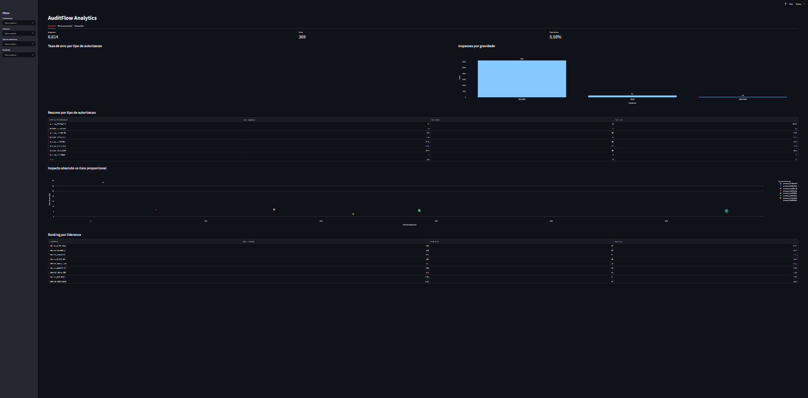
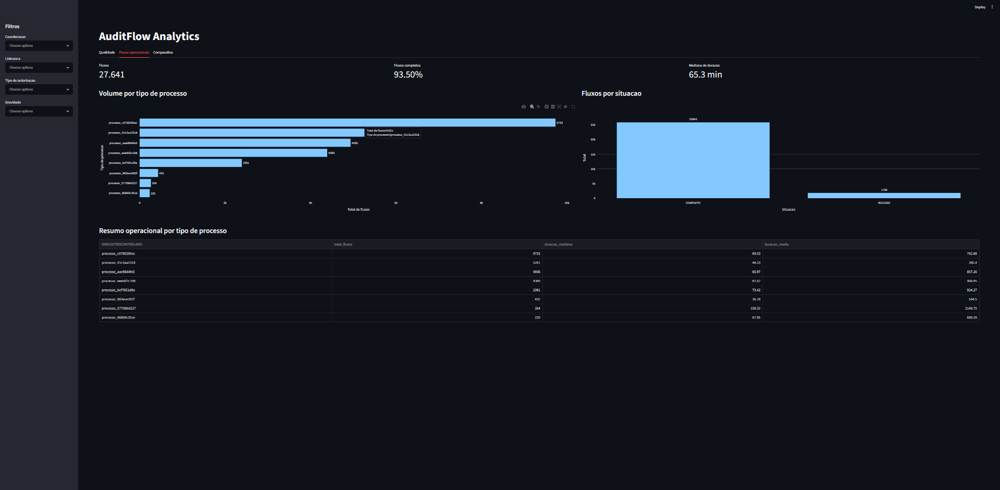
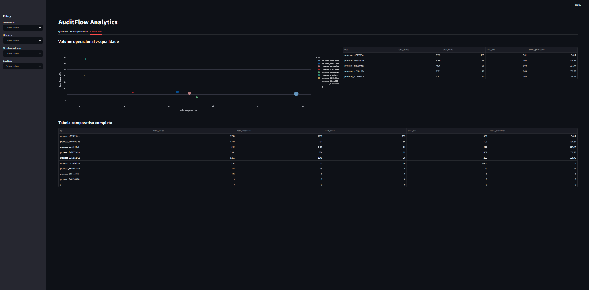

# AuditFlow Analytics

Projeto end-to-end de dados para analise de qualidade operacional.

O objetivo e transformar planilhas operacionais em um produto analitico com:

- pipeline de limpeza e anonimizacao em Python/pandas;
- banco local em DuckDB;
- consultas SQL para metricas;
- dashboard interativo em Streamlit;
- documentacao de dados e privacidade.

## Problema de Negocio

Equipes operacionais normalmente acompanham volume de trabalho e qualidade em planilhas separadas. Isso dificulta responder perguntas como:

- Quais tipos de processo concentram mais erros?
- Quais tipos possuem maior taxa proporcional de erro?
- Onde existe muito volume operacional e tambem risco de qualidade?
- Quais liderancas ou grupos precisam de acompanhamento?
- Quais processos possuem maior tempo de execucao?

Este projeto organiza esses dados em um fluxo reproduzivel e cria um dashboard para apoiar analise de qualidade, risco e priorizacao.

## Arquitetura

```text
Excel bruto
   |
   v
Python + pandas
   |
   v
CSVs limpos e anonimizados
   |
   v
DuckDB
   |
   v
SQL analitico
   |
   v
Dashboard Streamlit
```

## Stack

- Python
- pandas
- DuckDB
- SQL
- Streamlit
- Plotly
- openpyxl

## Estrutura do Projeto

```text
auditflow-analytics/
  app/
    streamlit_app.py
  data/
    raw/
    processed/
    database/
  docs/
    data_dictionary.md
  notebooks/
  outputs/
  sql/
    resumo_tipo_autorizacao.sql
    comparativo_operacao_qualidade.sql
  src/
    inspect_excel.py
    transform.py
    load_database.py
    run_pipeline.py
    aula_02_metricas.py
    aula_03_sql.py
  requirements.txt
```

## Como Rodar

Para portfolio publico, use dados sinteticos:

```bash
python src/run_sample_pipeline.py
streamlit run app/streamlit_app.py
```

Esse comando gera planilhas ficticias em:

```text
data/sample_raw/
```

Depois limpa, anonimiza, carrega o DuckDB e deixa o dashboard pronto para abrir.

Para estudo local com arquivos proprios, crie uma copia dos arquivos brutos dentro de `data/raw/` com estes nomes:

```text
data/raw/volume_fluxos.xlsx
data/raw/inspecoes_202511.xlsx
```

Instale as dependencias:

```bash
pip install -r requirements.txt
```

Rode o pipeline completo:

```bash
python src/run_pipeline.py
```

Abra o dashboard:

```bash
streamlit run app/streamlit_app.py
```

Se o comando `streamlit` nao funcionar:

```bash
python -m streamlit run app/streamlit_app.py
```

## Dashboard

O dashboard possui tres abas principais.

### Qualidade

Mostra:

- total de inspecoes;
- total de erros;
- taxa geral de erro;
- erros por gravidade;
- taxa de erro por tipo de autorizacao;
- comparacao entre impacto absoluto e risco proporcional;
- ranking por lideranca anonimizada.

### Fluxos Operacionais

Mostra:

- total de fluxos;
- percentual de fluxos completos;
- mediana de duracao;
- volume por tipo de processo;
- situacao dos fluxos;
- resumo operacional por tipo.

### Comparativo

Cruza operacao e qualidade por tipo de processo.

Metricas:

- volume de fluxos;
- total de inspecoes;
- total de erros;
- taxa de erro;
- score de prioridade.

O score inicial usado e:

```text
score_prioridade = total_fluxos * taxa_erro / 100
```

Ele ajuda a identificar tipos que combinam alto volume operacional com risco de qualidade.

## Screenshots

### Qualidade



### Fluxos Operacionais



### Comparativo



## Principais Insights

Exemplos de leituras geradas pelo projeto:

- A taxa geral de erro das inspecoes foi de aproximadamente 5,58%.
- Um tipo de processo concentrou o maior volume absoluto de erros.
- Outros tipos apresentaram maior taxa proporcional de erro.
- Volume absoluto e risco proporcional contam historias diferentes.
- A priorizacao deve considerar simultaneamente volume operacional e taxa de erro.

## Privacidade

Os dados originais vieram de contexto real de trabalho. Por isso, o projeto aplica anonimizacao antes da analise publica.

Campos anonimizados:

- usuarios;
- colaboradores;
- inspetores;
- documentos;
- coordenacoes;
- liderancas;
- cooperativas/unidades.
- nomes de processo;
- categorias internas de processo/autorizacao.

Tambem sao removidos textos sensiveis como descricoes e justificativas, mantendo apenas indicadores booleanos como `TEM_DESCRICAO` e `TEM_JUSTIFICATIVA`.

Categorias internas sao substituidas por codigos genericos como `processo_abc123def0`. A mesma regra e aplicada em fluxos e inspecoes para preservar comparacoes sem revelar termos internos.

Os arquivos reais nao devem ser publicados no GitHub.

Para publicar o projeto, use `src/run_sample_pipeline.py`, que gera dados sinteticos e evita expor informacoes de contexto real.

## Arquivos Importantes

- `src/inspect_excel.py`: diagnostico inicial dos arquivos Excel.
- `src/transform.py`: limpeza, padronizacao e anonimizacao.
- `src/load_database.py`: carga dos CSVs tratados no DuckDB.
- `src/run_pipeline.py`: execucao completa do pipeline.
- `src/run_sample_pipeline.py`: execucao completa com dados sinteticos para portfolio.
- `src/generate_sample_data.py`: geracao das planilhas ficticias.
- `sql/resumo_tipo_autorizacao.sql`: metrica de taxa de erro por tipo.
- `sql/comparativo_operacao_qualidade.sql`: comparativo entre operacao e qualidade.
- `app/streamlit_app.py`: dashboard interativo.
- `docs/data_dictionary.md`: dicionario de dados.

## Roteiro de Aprendizado

Este projeto tambem foi construido como trilha de estudo.

### Aula 1: Diagnostico dos Excel

Arquivo:

```text
src/inspect_excel.py
```

Conceitos:

- `pd.ExcelFile(...)`
- `pd.read_excel(...)`
- abas de uma planilha;
- amostra de dados;
- valores vazios;
- contagem de categorias.

### Aula 2: Primeiras Metricas com pandas

Arquivo:

```text
src/aula_02_metricas.py
```

Conceitos:

- coluna booleana;
- filtro;
- `groupby`;
- `agg`;
- contagem, soma e media;
- taxa percentual.

### Aula 3: SQL com DuckDB

Arquivos:

```text
src/load_database.py
src/aula_03_sql.py
sql/resumo_tipo_autorizacao.sql
```

Ponte conceitual:

```text
pandas groupby  ->  SQL GROUP BY
pandas sum      ->  SQL SUM
pandas mean     ->  SQL AVG
```

### Aula 4 em diante: Dashboard

Arquivo:

```text
app/streamlit_app.py
```

Conceitos:

- Streamlit;
- filtros interativos;
- KPIs;
- graficos com Plotly;
- storytelling com dados.

## Status e Proximas Melhorias

Concluido:

- Pipeline de limpeza e anonimizacao.
- Banco local com DuckDB.
- Dashboard interativo em Streamlit.
- Dados sinteticos para publicacao.
- Screenshots do dashboard em `assets/`.
- Documentacao de dados e checklist de GitHub.

Melhorias futuras:

- Adicionar testes simples para validar volumes e colunas esperadas.
- Melhorar o layout visual do dashboard.
- Adicionar analise temporal por data de inspecao e data do fluxo.
- Publicar uma versao online do dashboard.
